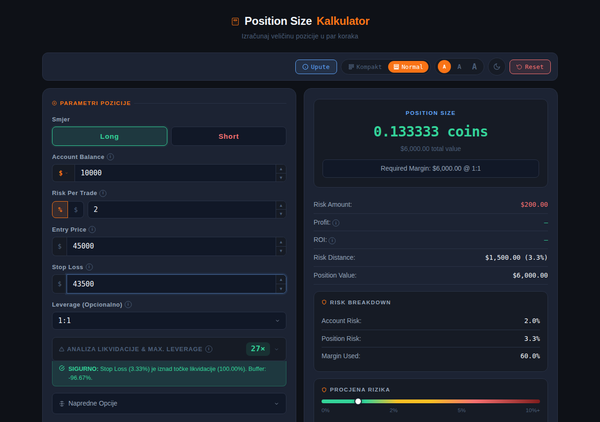
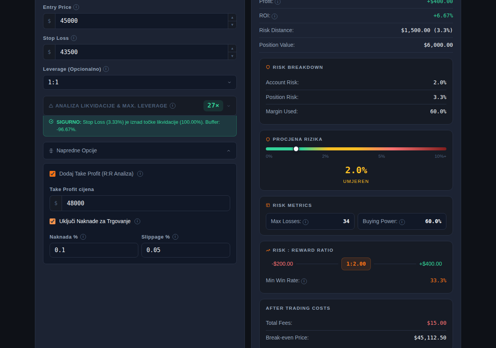
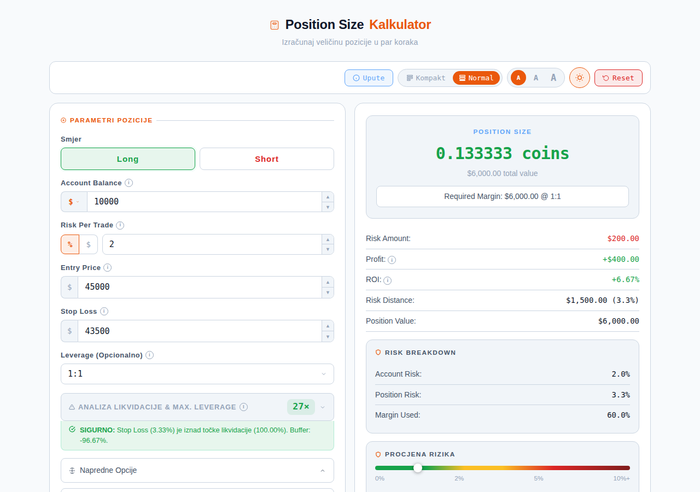
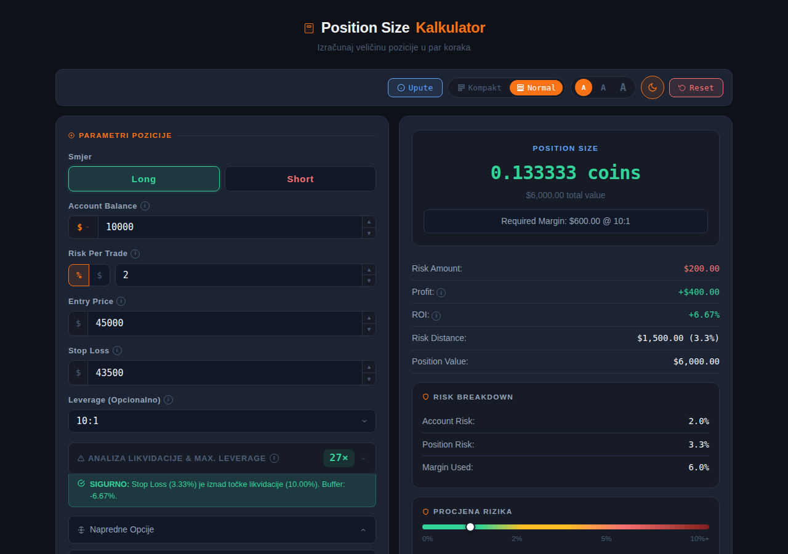
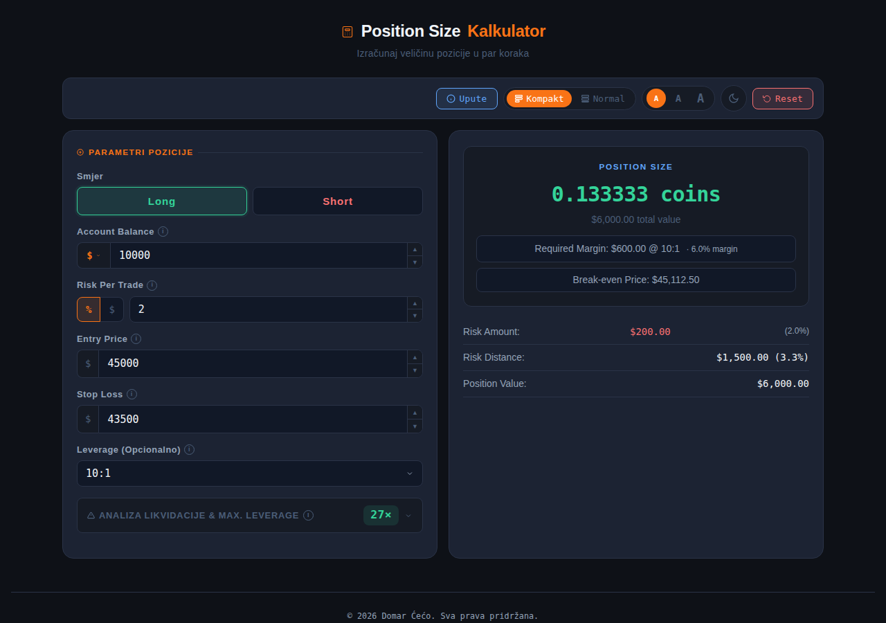

<div align="center">


# Position Size Kalkulator

**Kalkulator za izračun optimalne veličine pozicije pri trgovanju kriptovalutama i drugim financijskim instrumentima.**

Kontroliraj rizik, zaštiti kapital — u samo par koraka.

</div>


---

## 📌 O projektu

Position Size Kalkulator je samostalna web aplikacija koja ne zahtijeva instalaciju ni pozadinsku infrastrukturu — radi u potpunosti u pregledniku iz jedne `.html` datoteke. Osmišljena je kao brz i precizan alat koji traderima pomaže izračunati optimalnu veličinu pozicije na temelju stanja računa, definiranog rizika, cijene ulaska i stop loss razine.


Name: PositionSize_kalkulator_ Domar Ceco.html

SHA256: b67bf289dac075c2695b9b8bdefd812e3c891b5c0e3562b6f436f61a07c45db1

---

<div align="center">
  
# >>>>>>>>>>>>[DEMO](https://5ar2.github.io/Position-Size-Kalkulator/)<<<<<<<<<<<

</div>

---


## 🖼️ Screenshots

### Tamna tema — rezultati kalkulacije



### Napredne opcije — R:R analiza i naknade



### Svijetla tema



### Analiza Likvidacije & Max. Leverage



### Kompaktni prikaz



---

## ✨ Funkcionalnosti

### Osnovne
- **Long / Short** — odabir smjera pozicije s automatskom validacijom Stop Lossa
- **Multi-currency** podrška — USD (`$`), Euro (`€`), Kuna (`KN`) s realnim tečajima
- **Risk Per Trade** — unos rizika kao postotak balansa (`%`) ili apsolutni iznos (`$`)
- **Spinner kontrole** i podrška za kotačić miša na svim numeričkim poljima
- **Validacija smjera** — automatsko upozorenje ako je Stop Loss / Take Profit na krivoj strani Entry cijene

### Leverage & Likvidacija
- Odabir leverage-a od 1:1 do 100:1, s opcijom prilagođenog unosa
- **Analiza Likvidacije** — automatski izračunava maksimalni sigurni leverage na temelju Stop Loss udaljenosti
- Vizualni indikator (zelena / žuta / crvena) prema udaljenosti od likvidacijske točke

### Napredne opcije
- **Take Profit + R:R analiza** — Risk:Reward omjer, minimalna stopa pobjede (Break-Even Win Rate)
- **Naknade za trgovanje** — provizija burze + slippage, prikaz Break-even cijene

### Rezultati
| Metrika | Opis |
|---|---|
| **Position Size** | Optimalni broj jedinica za kupnju/prodaju |
| **Risk Amount** | Stvarni iznos u novcu koji se riskira |
| **Profit / ROI** | Očekivani profit i povrat uz zadani Take Profit |
| **Risk Distance** | Udaljenost Entry – Stop Loss u `$` i `%` |
| **Account Risk** | Postotak kapitala pod rizikom |
| **Margin Used** | Postotak balansa rezerviran kao margin |
| **Risk Gauge** | Vizualni mjerač razine rizika (0 – 10%+) |
| **Max Losses** | Broj uzastopnih gubitaka do 50% kapitala |
| **Buying Power** | Iskorištenost ukupne kupovne moći |
| **R:R Badge** | Risk:Reward omjer, npr. `1:2.00` |
| **Min Win Rate** | Minimalni `%` dobitnih trejdova za profitabilnost |
| **Total Fees** | Ukupni troškovi provizija i slippagea |
| **Break-even Price** | Cijena nultog rezultata uz naknade |

### UI / UX
- 🌙 **Tamna / Svijetla tema** — s preferencijom pohranjenom u browseru
- 🔤 **3 veličine fonta** — maleno, srednje, veliko
- 📋 **Kompaktni mod** — sažeti prikaz za manje ekrane
- 💡 **Tooltips** na svim metrikama (`ℹ` ikona)
- ⌨️ **Keyboard shortcut** — `Ctrl/Cmd + Backspace` za reset
- 💾 **Automatsko pamćenje** korisničkih preferencija (`localStorage`)
- 📖 **Upute** — ugrađeni modal s detaljnim objašnjenjima i primjerima
- ⚠️ **Risk Warning modal** — prikazuje se pri prvom pokretanju

---

## 🚀 Pokretanje

Aplikacija ne zahtijeva instalaciju, server ni build korake.

1. **Preuzmi** datoteku `PositionSize_kalkulator_ Domar Ceco.html`
2. **Otvori** je u bilo kojem modernom web pregledniku (Chrome, Firefox, Edge, Safari)
3. **Počni koristiti** — sve radi lokalno, bez internetske veze (osim Google Fonts za tipografiju)

```bash
# Ili kloniraj repozitorij
git clone https://github.com/<username>/position-size-kalkulator.git

# Otvori datoteku
open position-size-kalkulator.html
```

---

## 🧰 Tehnologije

Projekt je izgrađen isključivo s nativnim web tehnologijama — bez biblioteka, bez frameworka, bez build toolova.

| Tehnologija | Primjena |
|---|---|
| **HTML5** | Struktura i semantika |
| **CSS3** | Kompletno stiliziranje, CSS varijable, grid layout, animacije |
| **Vanilla JavaScript** | Sva logika kalkulacije i UI interakcije |
| **IBM Plex Sans + IBM Plex Mono** | Tipografija (Google Fonts) |
| **localStorage** | Pohrana korisničkih preferencija (tema, font, mod) |

---

## 📐 Primjer kalkulacije

Scenarij: Trading BTC-om sa $10,000 na računu, 2% rizika.

| Parametar | Vrijednost |
|---|---|
| Account Balance | $10,000 |
| Risk Per Trade | 2% |
| Entry Price | $45,000 |
| Stop Loss | $43,500 |
| Take Profit | $48,000 |
| Leverage | 1:1 |

**Rezultati:**

| Rezultat | Vrijednost |
|---|---|
| **Position Size** | **0.1333 BTC** |
| Risk Amount | $200.00 |
| Risk Distance | $1,500 (3.33%) |
| Profit (@ TP) | +$400.00 |
| ROI | +6.67% |
| R:R omjer | **1 : 2.00** |
| Min Win Rate | 33.3% |

---

## ⚙️ Preporučene postavke rizika

| Razina | Account Risk | Profil |
|---|---|---|
| 🟢 Konzervativno | < 1% | Početnici, kapitalna zaštita |
| 🟢 Preporučeno | 1 – 2% | Iskusni traderi |
| 🟡 Umjereno | 2 – 3% | Napredni traderi |
| 🟠 Agresivno | 3 – 5% | Visoka tolerancija rizika |
| 🔴 Visoko | > 5% | Nije preporučljivo |

---

## ⚠️ DISCLAIMER — Odricanje od odgovornosti

> **Ovaj kalkulator služi isključivo u informativne i edukativne svrhe.**

Sve informacije i izračuni prikazani putem ove aplikacije namijenjeni su isključivo kao opći informativni i edukativni materijal. Aplikacija **ne predstavlja** financijski savjet, investicijsku preporuku, ponudu ni poziv za kupnju ili prodaju bilo kojeg financijskog instrumenta u smislu Zakona o tržištu kapitala, MiFID II direktive niti bilo kojeg drugog relevantnog propisa.

**Rizici:**

Trgovanje financijskim instrumentima — uključujući, ali ne ograničavajući se na, kriptovalute, CFD-ove, forex, dionice i izvedenice — nosi visok stupanj rizika. Može rezultirati gubitkom dijela ili **cijelog uloženog kapitala**, a u slučaju korištenja poluge i gubitkom koji premašuje iznos inicijalnog ulaganja.

**Točnost podataka:**

Iako su uloženi napori da izračuni budu točni, autor ne jamči potpunu preciznost, ažurnost ni potpunost prikazanih podataka. Tržišni uvjeti, provizije i tečajevi podložni su promjenama. **Prošle performanse nisu pokazatelj budućih rezultata.**

**Odgovornost korisnika:**

Sve odluke o trgovanju korisnik donosi **isključivo na vlastitu odgovornost**. Autor — **Domar Ćećo** — ne može biti odgovoran za financijske gubitke koji proizlaze iz odluka o trgovanju donesenih na temelju podataka prikazanih u ovoj aplikaciji. Prije donošenja bilo kakvih investicijskih ili trgovačkih odluka, preporučuje se savjetovanje s neovisnim, licenciranim financijskim savjetnikom.

---

## 📄 Licenca

© 2025 **Domar Ćećo**. Sva prava pridržana.

Ova aplikacija nije open-source. Nije dopušteno kopiranje, redistribucija, modifikacija ni komercijalna upotreba bez izričitog pisanog odobrenja autora.

---

<div align="center">
  <sub>Napravio da nikad više ne kalkuliram ručno u 3 ujutro — <strong>Domar Ćećo</strong></sub>
</div>
